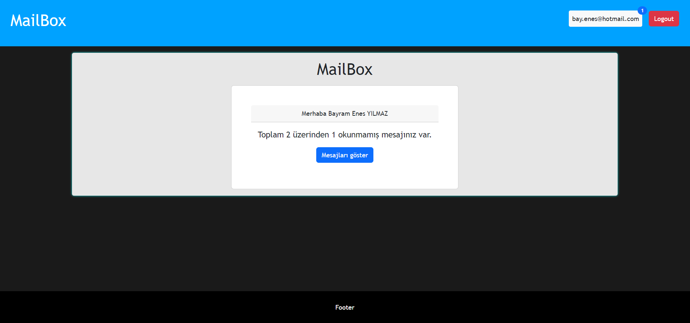
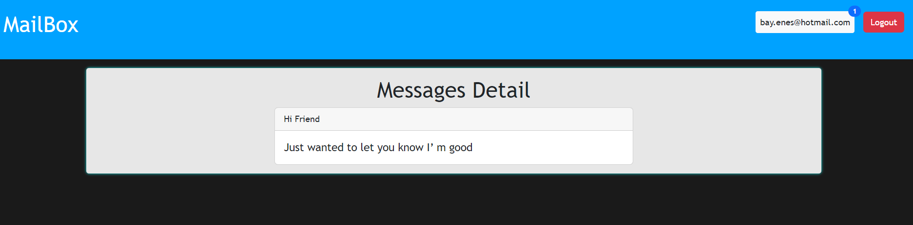

# MailBox
Projede backend kısmında node.js frontend kısmında react.js kullandım.

## Kullanıcı giriş bilgileri :

1) Kullanıcı
   * email : bay.enes@hotmail.com  
   * şifre: enes123
#
2) Kullanıcı
   * email : ahmet@hotmail.com  
   * şifre: ahmet123

#
## Proje video : 

## Proje ekran görüntüleri : 

